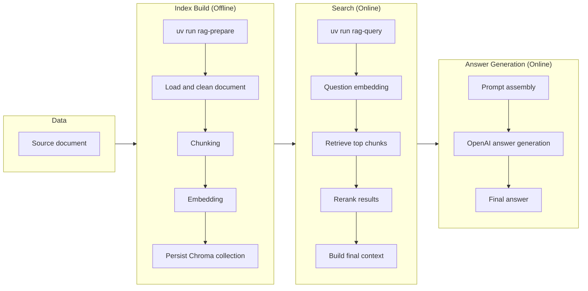

# ai-rag

A minimal RAG demo.

This project is organized around two separate flows:

1. Prepare data: read the source document, split it into chunks, generate local embeddings with SentenceTransformer, and persist a local Chroma index.
2. Query data: embed the user question with SentenceTransformer, retrieve chunks, rerank them with CrossEncoder, assemble context, and generate the final answer.

Both commands print step-by-step progress so the demo is easy to follow.
`shared.py` is kept only for the small set of defaults and helper functions reused by both commands.

## Demo Output

```text
Query:
后羿射下的两颗太阳最终分别转化成了什么形态？

Retrieval results (top 5 candidates):
1. chunk-0010 | position=10 | distance=0.3526
2. chunk-0008 | position=8  | distance=0.3575
3. chunk-0012 | position=12 | distance=0.3959
4. chunk-0013 | position=13 | distance=0.4110
5. chunk-0009 | position=9  | distance=0.4490

Reranked results (top 3 kept):
1. chunk-0010 | position=10 | rerank_score=0.0074
2. chunk-0013 | position=13 | rerank_score=0.0063
3. chunk-0009 | position=9  | rerank_score=0.0043

Final answer:
后羿射下的两颗太阳最终分别转化成了：一颗变成了微型黑洞并迅速蒸发，另一颗被压成了一颗微小、致密的白矮星。
```

## Files

```text
.
├── prepare.py
├── query.py
├── shared.py
├── data/source.md
├── .env.example
├── pyproject.toml
└── README.md
```

## Configuration

- `OPENAI_API_KEY`: Required only for the final answer generation step.
- `OPENAI_BASE_URL`: Optional. Use this when calling an OpenAI-compatible API server.
- `OPENAI_MODEL`: Optional override. Default in code: `gpt-5.1`.

The first run will download the local embedding and rerank models from Hugging Face.

## Run

```bash
cp .env.example .env
uv sync

# Step 1: prepare the local index
uv run rag-prepare

# Step 2: query the prepared index
uv run rag-query

# Ask a custom question
uv run rag-query --query "your question"
```

`rag-query` uses the built-in demo question by default.

## Architecture and Flow

The project is split into two commands plus one shared utility module:

- `prepare.py`: reads the source document, splits it into chunks, generates local embeddings, and rebuilds the local Chroma index.
- `query.py`: embeds the question, retrieves and reranks chunks, assembles context, and generates the final answer.
- `shared.py`: stores the small set of defaults and helper functions shared by both commands.


